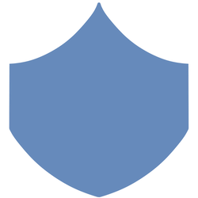

# Trial of Anima

<<<<<<< HEAD
MindRPG is a MERN stack Role-Playing Game that gives the user a short game experience that intends to help their mindfulness state. 
=======
Trial of Anima is a MERN stack Role-Playing Game that gives the user a short game experience that intends to help their mindfulness state. 
>>>>>>> 72a0a3ef18252abe0b0907def4e6579deb5d362c

## Instructions
In order to play the game, user must sign up and create a login account. Once the user has logged in, the option to start the game will appear. 

## How To Play

The objective is to defeat a gauntlet of enemies and beat the final boss. 

There are 3 playable classes, each with their own unique stats:

 Attack: Affects how much damage can be dealt. 

 Defense: Affects the amount of damage mitigated.

 Critical: Affects the amount of damage dealt on a critical hit.

---

### Character Select

On the character select screen, you must click on one of the characters in order to start game. You can click the stat button below each class to see their stats. 

---

### Battle

Once you have entered a battle, the user will have an option to either attack or defend. Users will notice a red skull in the middle of the screen. The percentage on the skull indicates the chance of the emeny inflicting a critical hit. 

You can also look at the enemy's stats by clicking on the stat button below it.

---

### End

When the user finishes the game, the clear counter above will increment once the page refreshes.

Try to see how many clears you can get!

# Contributors

[@Cody Covington](https://github.com/codycovington)

[@Andrew Park](https://github.com/apark5040)

[@Daniel Pruitt](https://github.com/danielpruitt)

[@James Kendall Bruce](https://github.com/jameskendallbruce)

[@May Burgos](https://github.com/ExactlyMay)

Additional thanks to [Kendall](https://github.com/jameskendallbruce) for creating the characters, enemies and the icons for this game. 

# Note

The background image used for the game is from the video game "Darkest Dungeon" by Red Hook Studios. This project is not meant to endorse or sponsor the game and is intended only for project demonstration. 
